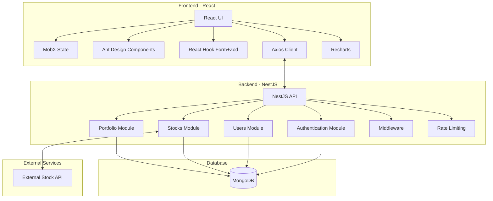
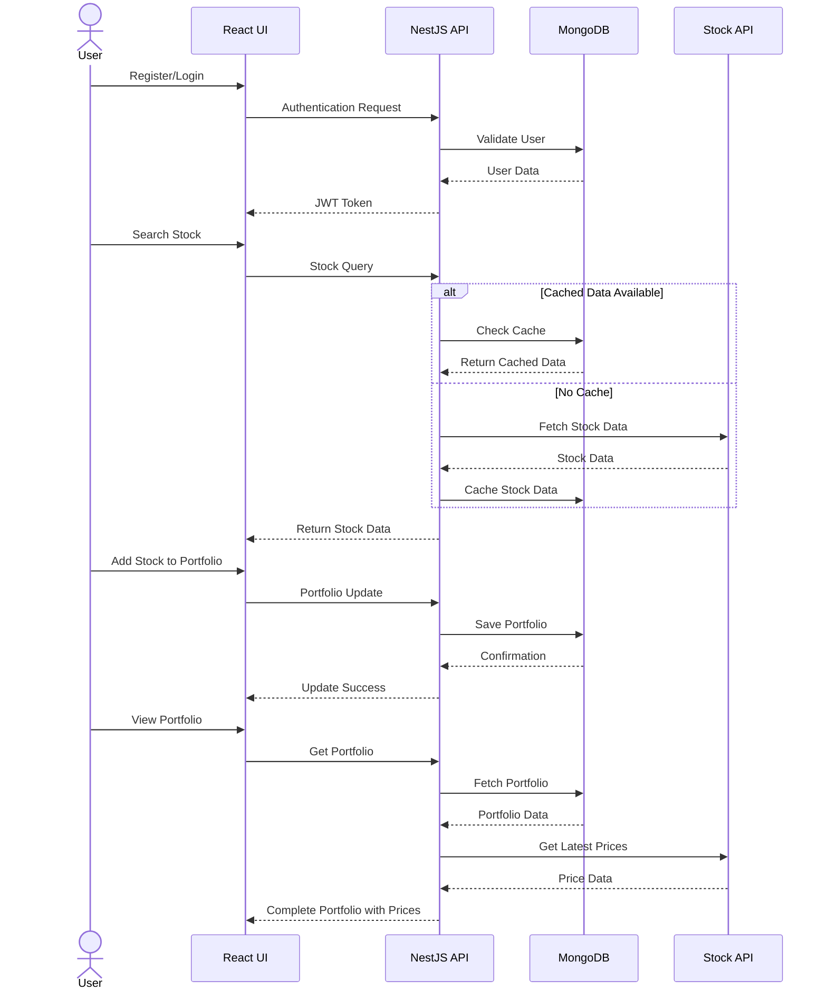

# Y - Stock Portfolio Application

A full-stack application for tracking stock portfolios built with NestJS, React, and MongoDB.

## Getting Started

### Prerequisites

- Node.js (v18+)
- Docker and Docker Compose
- npm

### Running the Application

1. **Start the database container**

```bash
docker-compose up mongo -d
```

2. **Start the application**

```bash
npm run start
```

This command starts both the API server and web client concurrently.

3. **Access the application**

- Frontend: [http://localhost:4200](http://localhost:4200)
- API: [http://localhost:3001/api](http://localhost:3001/api)

4. **Register a new account**

Navigate to the registration page and create a new account with your email and password to start using the application.

## Application Architecture

### Overview

This project is a monorepo managed with Nx, consisting of:

- **Frontend**: React application for the user interface
- **Backend**: NestJS API server
- **Database**: MongoDB for data persistence
- **E2E Testing**: Playwright for end-to-end tests

### API Architecture

The API is built with NestJS and follows a modular architecture:

- **Authentication**: JWT-based authentication with secure cookie sessions
- **Users**: User management and registration
- **Stocks**: Stock data fetching and caching
- **Portfolio**: User portfolio management
- **Database**: MongoDB integration using Mongoose

Key features:

- RESTful API design
- Request rate limiting
- Data validation with class-validator
- API documentation with Swagger
- Caching for stock data to minimize external API calls

### Frontend Architecture

The web client is built with React and follows a modern architecture:

- **State Management**: MobX for reactive state management
- **Routing**: React Router for navigation
- **UI Components**: Ant Design component library
- **Forms**: React Hook Form with validation
- **HTTP Client**: Axios for API requests
- **Styling**: Tailwind CSS for utility-first styling
- **Charts**: Recharts for data visualization

The application is structured with:

- Feature-based organization
- Reusable components
- Custom hooks for shared logic
- Service layer for API interactions
- Strong TypeScript typing

## Testing

### API Tests

To run the API unit tests:

```bash
nx test api
```

These tests verify the functionality of API endpoints, services, and controllers.

### Frontend E2E Tests

To run end-to-end tests for the web application:

```bash
nx e2e web-e2e
```

**Note**: The Playwright tests are currently experiencing issues related to rate limiting from external stock APIs. Some locators may need to be fixed . this tests arent functional ATM.

## Development

### Available Commands

- `nx serve web`: Start the web client in development mode
- `nx serve api`: Start the API server in development mode
- `nx build web`: Build the web client for production
- `nx build api`: Build the API server for production
- `nx lint web`: Lint the web client code
- `nx lint api`: Lint the API server code

- The stock data cache duration is currently set to 15 minutes. In a production environment, this should be controlled from a remote key-value store for dynamic adjustments , and most likely will be implemented in a redis server.

### Technical Architecture




## Data Flow Diagram



## Technical Stack

- **Frontend**:

  - React
  - MobX
  - React Router
  - Ant Design
  - Tailwind CSS
  - Recharts for data visualization
  - TypeScript

- **Backend**:

  - NestJS
  - JWT Authentication
  - Class Validator
  - Swagger for API documentation
  - Mongoose
  - TypeScript

- **Database**:

  - MongoDB

- **DevOps**:

  - Docker
  - Docker Compose
  - Nginx for web serving

- **Testing**:

  - Jest for unit tests
  - Playwright for E2E tests

- **Infrastructure**:
  - Nx Monorepo structure
